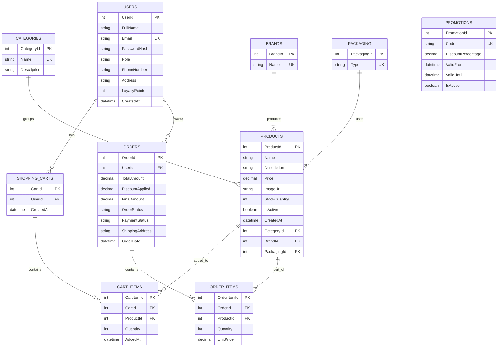

```mermaid
erDiagram
    USERS {
        int UserId PK
        string FullName
        string Email UK
        string PasswordHash
        string Role
        string PhoneNumber
        string Address
        int LoyaltyPoints
        datetime CreatedAt
    }

    CATEGORIES {
        int CategoryId PK
        string Name UK
        string Description
    }

    BRANDS {
        int BrandId PK
        string Name UK
    }

    PACKAGING {
        int PackagingId PK
        string Type UK
    }

    PRODUCTS {
        int ProductId PK
        string Name
        string Description
        decimal Price
        string ImageUrl
        int StockQuantity
        boolean IsActive
        datetime CreatedAt
        int CategoryId FK
        int BrandId FK
        int PackagingId FK
    }

    SHOPPING_CARTS {
        int CartId PK
        int UserId FK
        datetime CreatedAt
    }

    CART_ITEMS {
        int CartItemId PK
        int CartId FK
        int ProductId FK
        int Quantity
        datetime AddedAt
    }

    ORDERS {
        int OrderId PK
        int UserId FK
        decimal TotalAmount
        decimal DiscountApplied
        decimal FinalAmount
        string OrderStatus
        string PaymentStatus
        string ShippingAddress
        datetime OrderDate
    }

    ORDER_ITEMS {
        int OrderItemId PK
        int OrderId FK
        int ProductId FK
        int Quantity
        decimal UnitPrice
    }

    PROMOTIONS {
        int PromotionId PK
        string Code UK
        decimal DiscountPercentage
        datetime ValidFrom
        datetime ValidUntil
        boolean IsActive
    }

    USERS ||--o{ SHOPPING_CARTS : has
    USERS ||--o{ ORDERS : places
    CATEGORIES ||--|{ PRODUCTS : groups
    BRANDS ||--|{ PRODUCTS : produces
    PACKAGING ||--|{ PRODUCTS : uses
    SHOPPING_CARTS ||--o{ CART_ITEMS : contains
    PRODUCTS ||--o{ CART_ITEMS : added_to
    ORDERS ||--|{ ORDER_ITEMS : contains
    PRODUCTS ||--o{ ORDER_ITEMS : part_of
```
